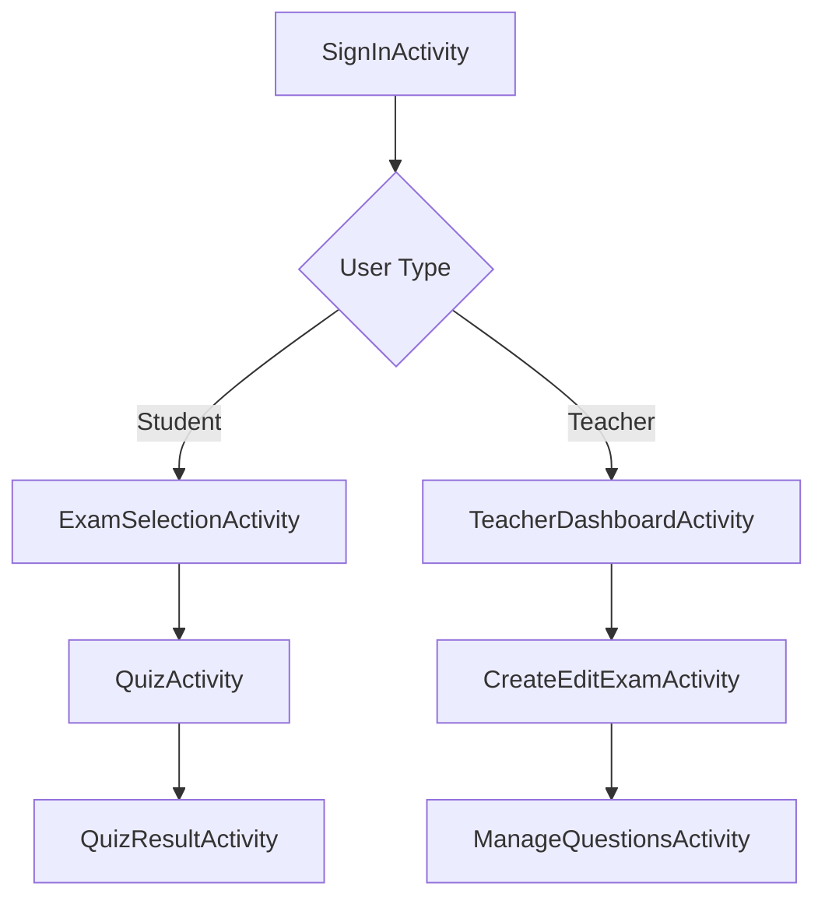
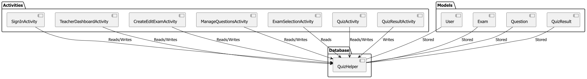

# Android Quiz Application


## Overview
A role-based quiz application for educational institutions featuring:
- **Teacher workflow**: Create/manage exams and questions
- **Student workflow**: Take quizzes and view results
- **Material Design UI** with responsive layouts
- **SQLite database** for local data persistence

## Key Features
| Feature | Description |
|---------|-------------|
| **Role-based Auth** | Student/Teacher authentication with auto-registration |
| **Exam Management** | Create/edit/publish exams with metadata |
| **Question Bank** | Support for MCQ & True/False questions |
| **Quiz Interface** | Adaptive UI with real-time feedback |
| **Result Tracking** | Historical performance records |

## Application Architecture
### Activity Workflow


### Database Schema


**Core Tables:**
```sql
CREATE TABLE users (
    id INTEGER PRIMARY KEY AUTOINCREMENT,
    student_id TEXT UNIQUE,
    phone_number TEXT,
    user_type TEXT
);

CREATE TABLE exams (
    id INTEGER PRIMARY KEY AUTOINCREMENT,
    exam_name TEXT UNIQUE,
    teacher_id INTEGER,
    question_count INTEGER,
    published INTEGER DEFAULT 0
);

CREATE TABLE questions (
    id INTEGER PRIMARY KEY AUTOINCREMENT,
    question_text TEXT,
    option_a TEXT,
    option_b TEXT,
    option_c TEXT,
    option_d TEXT,
    correct_answer INTEGER,
    is_true_false INTEGER DEFAULT 0,
    exam_id INTEGER
);
```

## 📸 Application Screenshots

### Authentication
| Sign-In | Registration |
|---------|-------------|
|  |  |

### Teacher Workflow
| Dashboard | Exam Creation |
|-----------|--------------|
|  |  |

| Question Management | Question Editor |
|---------------------|----------------|
|  |  |

### Student Workflow
| Exam Selection | Quiz Interface |
|----------------|----------------|
|  |  |

| Results Screen |  | 
|----------------|--|
|  |  |

## Technical Implementation
**Core Components:**
```java
// Database Helper
public class QuizHelper extends SQLiteOpenHelper {
    // Database operations
    public long createExam(Exam exam) { ... }
    public List<Exam> getPublishedExams() { ... }
    public List<Question> getQuestionsByExamId(int examId) { ... }
}

// Question Type Handling
cbIsTrueFalse.setOnCheckedChangeListener((buttonView, isChecked) -> {
    if (isChecked) {
        etOptionC.setVisibility(View.GONE);
        etOptionD.setVisibility(View.GONE);
    } else {
        etOptionC.setVisibility(View.VISIBLE);
        etOptionD.setVisibility(View.VISIBLE);
    }
});
```

## Clean Code Practices
- **SRP Compliance**: Dedicated activities for each feature
- **Database Abstraction**: Centralized `QuizHelper` class
- **Resource Management**: Explicit DB connection closing
- **Validation**: Robust input checks throughout
- **Constants Class**: Avoids hardcoded strings

## Future Enhancements
1. Cloud synchronization for cross-device support
2. Support for image-based questions
3. Timed exams with auto-submission
4. Advanced analytics dashboard
5. Exam schedule notifications
